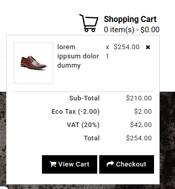

# Closures

A closure is the combination of a function bundled together (enclosed) with references to its surrounding state (the lexical environment). In other words, a closure gives you access to an outer function’s scope from an inner function. In JavaScript, closures are created every time a function is created, at function creation time.


```comment out each code examples one by one and run.```

[Examples](index.js)

#### Assignment

* Create shopping cart using closure  <br/>
  You can take the example from eBay [ebay.com](https://www.ebay.com).

* In the next assignments, you will create an eCommerce app, to design it so that you can easily use it again.


* 
    1. Create a product page, The user can buy the product or add it to the wishlist
    

    2. If user add to cart, add to the product card.
    

    3. Shopping Cart.
    
    