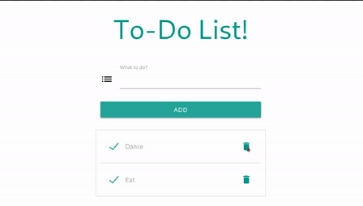

# DOM

 The Document object has various properties that refer to other objects which allow access to and modification of document content. The way a document content is accessed and modified is called the Document Object Model, or DOM. The Objects are organized in a hierarchy.

 #### Assignment

create TODO UI using DOM

